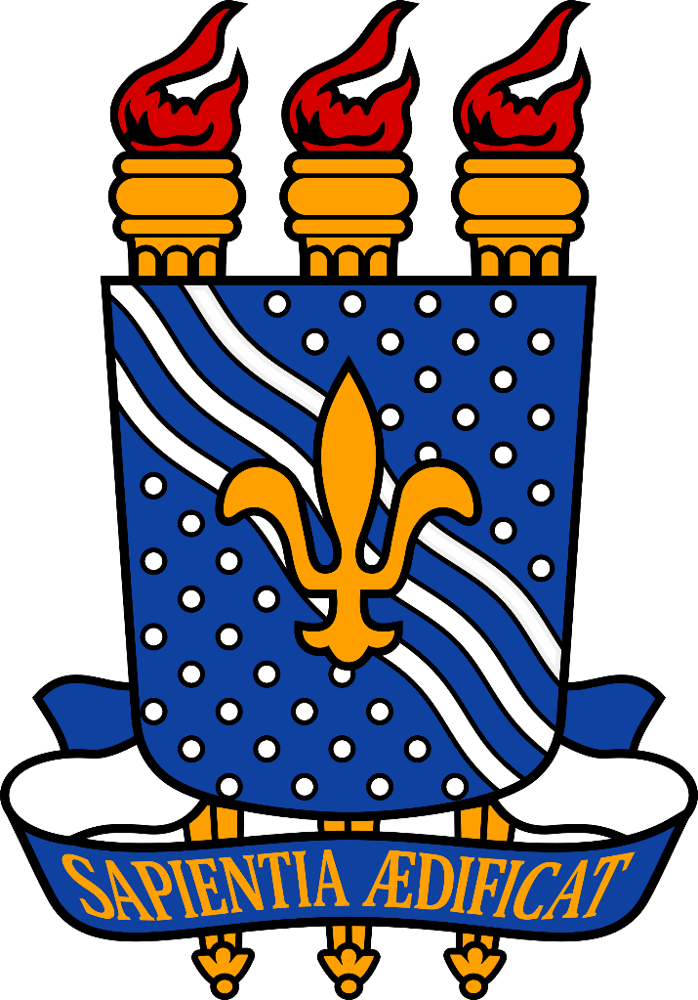

  

### UNIVERSIDADE FEDERAL DA PARAÍBA

### CAMPUS IV – CENTRO DE CIÊNCIAS APLICADAS E EDUCAÇÃO – RIO TINTO/PB

Curso: Licenciatura em Ciências da Computação – LCC

Componente Curricular: PROGRAMACAO ORIENTADA A OBJETOS – 8103138

Prof.: Ayla Debora Danta de Souza Reboucas
#
Alunos:

José Roberto da Silva Henrique

Alessandro Pereira Marcelino da Silva

José Wendel Pereira Lima

#

Rio Tinto
 2024

#
